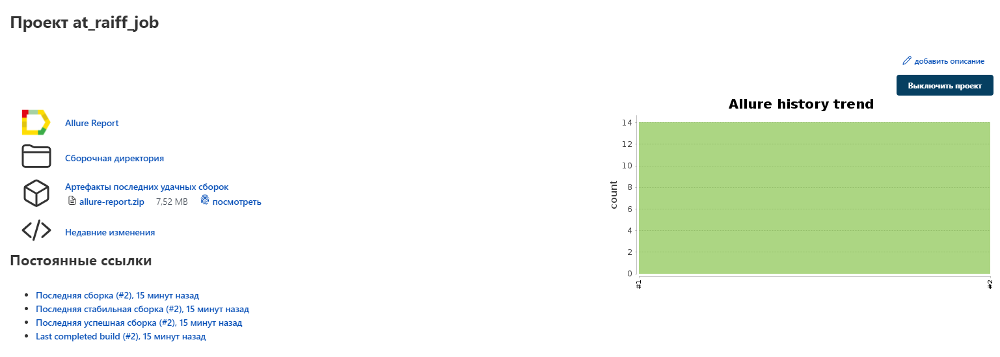
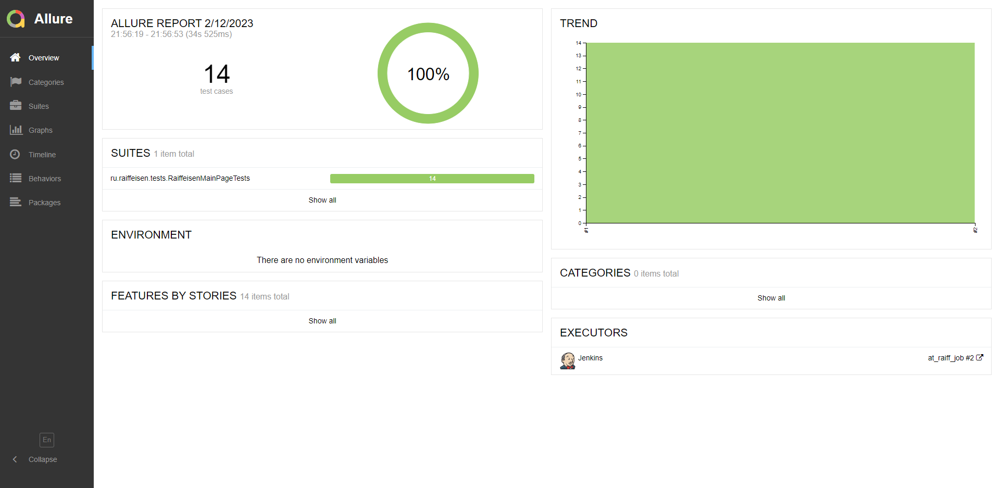
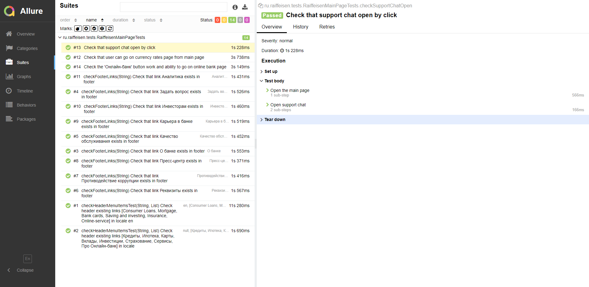
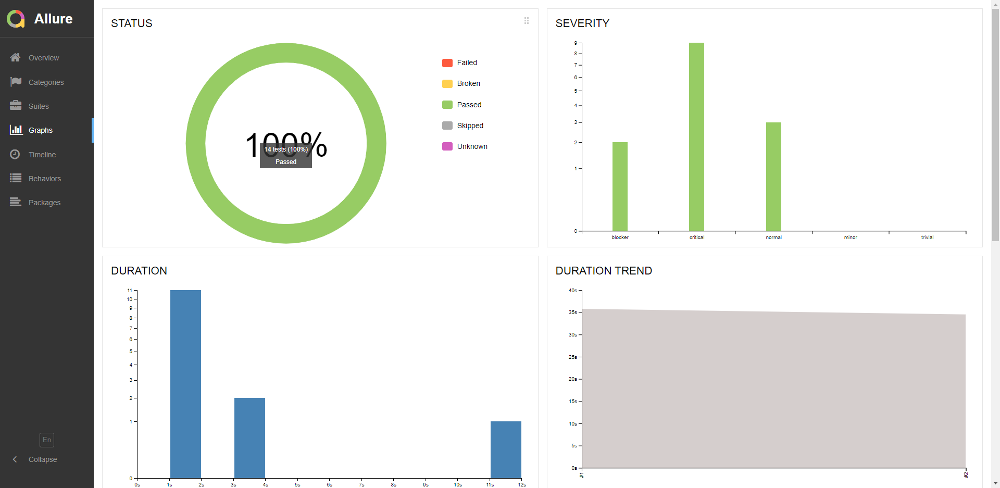
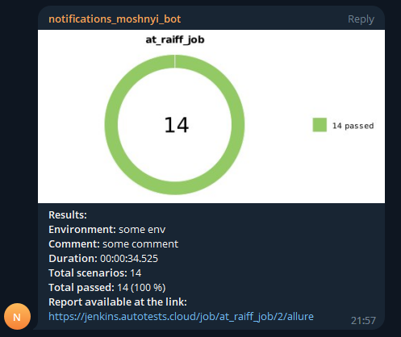

# Проект по автоматизации тестирования для Райфайзен Банк
<a target="_blank" href="https://www.raiffeisen.ru/">Сайт Райфайзен банка</a>

## :pushpin: Содержание:

- [Технологии и инструменты](#earth_africa-технологии-и-инструменты)
- [Реализованные проверки](#earth_africa-Реализованные-проверки)
- [Сборка в Jenkins](#earth_africa-Jenkins-job)
- [Запуск из терминала](#earth_africa-Запуск-тестов-из-терминала)
- [Allure отчет](#earth_africa-Allure-отчет)
- [Отчет в Telegram](#earth_africa-Уведомление-в-Telegram-при-помощи-бота)
- [Видео примеры прохождения тестов](#earth_africa-Примеры-видео-о-прохождении-тестов)

## :rocket: Технологии и инструменты

<p align="center">
<a href="https://www.jetbrains.com/idea/"></a>
<a href="https://www.java.com/"></a>
<a href="https://github.com/"></a>
<a href="https://junit.org/junit5/"></a>
<a href="https://gradle.org/"></a>
<a href="https://selenide.org/"></a>
<a href="https://aerokube.com/selenoid/"></a>
<a href="https://github.com/allure-framework/allure2"></a>
<a href="https://www.jenkins.io/"></a>
</p>

## :scroll: Реализованные проверки

- ✓ Проверка наличия ссылок меню в хэддере в en и ru локалях.
- ✓ Проверка наличия ссылок меню в футтере.
- ✓ Проверка перехода на страницу с курсами валют с главной страницы.
- ✓ Проверка открытия чата для поддержки пользователей.
- ✓ Проверка перехода на сайт онлайн-банка.

## </a> Jenkins job
<a target="_blank" href="https://jenkins.autotests.cloud/job/at_raiff_job/">Сборка в Jenkins</a>
<p align="center">
<a href="https://jenkins.autotests.cloud/job/at_raiff_job/"></a>
</p>

### Параметры сборки в Jenkins:

- browser (браузер, по умолчанию chrome)
- browserVersion (версия браузера, по умолчанию 100.0)
- browserSize (размер окна браузера, по умолчанию 1920x1080)
- remoteURL, login, password (адрес удаленного сервера selenoid, логин, пароль)
- videoStorage (адрес, по которому можно получить видео)

## :computer: Запуск тестов из терминала

Локальный запуск:
```bash
gradle clean test
```

Удаленный запуск:
```bash
clean
test
-Dbrowser=${BROWSER}
-DbrowserVersion=${BROWSER_VERSION}
-DbrowserSize=${BROWSER_SIZE}
-Dlogin=${login}
-Dpassword=${password}
-DremoteURL=${remoteURL}
```

## </a> Отчет в <a target="_blank" href="https://jenkins.autotests.cloud/job/at_raiff_job/2/allure/">Allure report</a>

### Основное окно

<p align="center">

</p>

### Тесты

<p align="center">

</p>

### Графики

<p align="center">

</p>

## </a> Уведомление в Telegram при помощи бота

<p align="center">

</p>


### </a> Пример видео о прохождении тестов

<p align="center">

</p>
